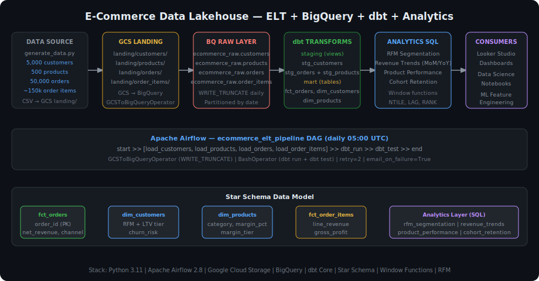

# E-Commerce Data Lakehouse


End-to-end e-commerce ELT pipeline: synthetic data generation → GCS → BigQuery raw layer → dbt transforms (star schema) → advanced analytics SQL. Covers RFM customer segmentation, monthly/YoY revenue trends, product performance ranking, and cohort retention — all orchestrated by Apache Airflow.

## Architecture



## Pipeline Overview

```
generate_data.py  (5k customers, 500 products, 50k orders)
   └── GCS landing zone  (CSV files)
         └── Airflow GCSToBigQueryOperator
               └── BigQuery ecommerce_raw  (customers, products, orders, order_items)
                     └── dbt run  (staging views → mart tables)
                           └── dbt test  (schema + data quality tests)
                                 └── Analytics SQL  (RFM, trends, cohorts, performance)
```

## Project Structure

```
ecommerce-data-lakehouse/
├── scripts/
│   └── generate_data.py         # Synthetic data generator (configurable scale)
├── airflow/
│   └── dags/ecommerce_elt_dag.py
├── sql/
│   ├── schema/
│   │   └── 01_create_raw_tables.sql
│   └── analytics/
│       ├── rfm_segmentation.sql         # NTILE-based RFM scoring + segments
│       ├── revenue_trends.sql           # MoM + YoY revenue with LAG
│       ├── product_performance.sql      # RANK within category + margin
│       └── customer_cohort_retention.sql
├── data/                         # Sample CSV files (committed for demo)
│   ├── customers.csv
│   ├── products.csv
│   └── orders.csv
├── snapshots/
│   └── architecture.svg
├── .env.example
└── requirements.txt
```

## Analytics Queries

**RFM Segmentation** (`sql/analytics/rfm_segmentation.sql`)
Scores every customer 1–4 on Recency, Frequency, and Monetary value using `NTILE(4)` window functions, then classifies them into segments: Champions, Loyal Customers, At Risk, Hibernating, Lost, etc.

**Revenue Trends** (`sql/analytics/revenue_trends.sql`)
Monthly revenue with month-over-month and year-over-year growth using `LAG()`. Plus channel revenue breakdown with `SUM() OVER ()` share percentage.

**Product Performance** (`sql/analytics/product_performance.sql`)
Units sold, total revenue, gross profit, and margin per product. `RANK()` within each category to identify top performers.

**Cohort Retention** (`sql/analytics/customer_cohort_retention.sql`)
Monthly signup cohorts tracked through 12 months of purchase activity. Outputs a retention matrix: % of each cohort still purchasing each month.

## Quick Start

```bash
# 1. Install
git clone https://github.com/jaiminbabariya7/ecommerce-data-lakehouse.git
cd ecommerce-data-lakehouse && pip install -r requirements.txt

# 2. Generate synthetic data
python scripts/generate_data.py --customers 5000 --orders 50000 --out data/

# 3. Upload to GCS
gsutil -m cp data/*.csv gs://$GCS_ECOMMERCE_BUCKET/landing/

# 4. Create BigQuery raw tables
bq query --use_legacy_sql=false < sql/schema/01_create_raw_tables.sql

# 5. Run the Airflow DAG
airflow dags trigger ecommerce_elt_pipeline

# 6. Run analytics queries in BigQuery console
# Replace PROJECT_ID with your actual project ID
```

## Tech Stack

| Component | Technology |
|---|---|
| Orchestration | Apache Airflow 2.8 |
| Storage | Google Cloud Storage |
| Data Warehouse | Google BigQuery |
| Transforms | dbt Core 1.7 |
| Language | Python 3.11 |
| Analytics | BigQuery SQL (window functions, CTEs) |
| Data Modelling | Star Schema (fact + dimension tables) |